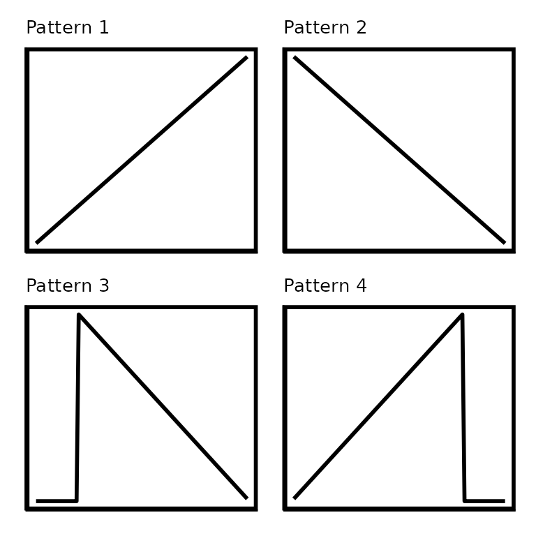
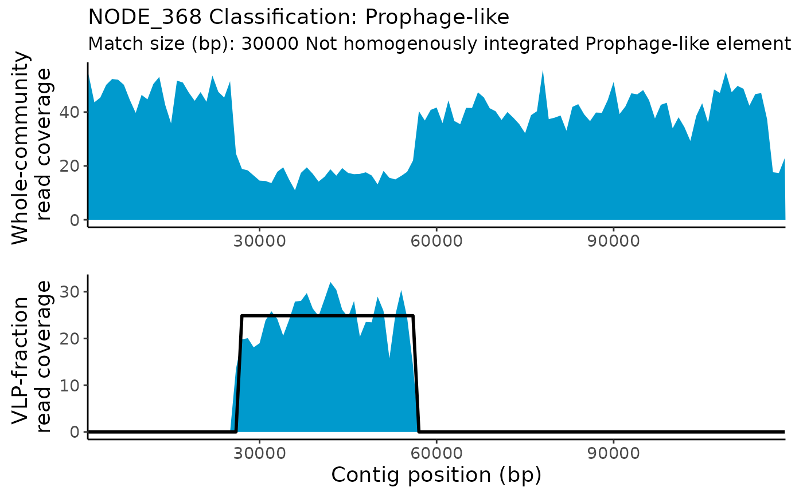

# TrIdent

## Introduction

**TrIdent**- **Tr**ansduction **Ident**ification

TrIdent consists of three main functions which should be run in the
following order:

1.  **[`TrIdentClassifier()`](https://jlmaier12.github.io/TrIdent/reference/TrIdentClassifier.md)**:
    Classifies contigs as ‘Prophage-like’, ‘Sloping’,
    ‘HighCovNoPattern’, and ‘NoPattern’ using read coverage
    pattern-matching.
2.  **[`plotTrIdentResults()`](https://jlmaier12.github.io/TrIdent/reference/plotTrIdentResults.md)**:
    Plots pattern-matching results of
    [`TrIdentClassifier()`](https://jlmaier12.github.io/TrIdent/reference/TrIdentClassifier.md).
3.  **[`specializedTransductionID()`](https://jlmaier12.github.io/TrIdent/reference/specializedTransductionID.md)**:
    Searches contigs classified as Prophage-like by
    [`TrIdentClassifier()`](https://jlmaier12.github.io/TrIdent/reference/TrIdentClassifier.md)
    for associated specialized transduction events.

TrIdent automates the analysis of transductomics data by detecting,
classifying, and characterizing read coverage patterns associated with
potential transduction events. Transductomics, developed by Kleiner et
al.  (2020), is a DNA sequencing-based method for the detection and
characterization of transduction events in pure cultures and complex
communities. Transductomics relies on mapping sequencing reads from a
viral-like particle (VLP)-fraction of a sample to contigs assembled from
the metagenome (whole-community) of the same sample. Reads from
bacterial DNA carried by VLPs will map back to the bacterial contigs of
origin creating read coverage patterns indicative of ongoing
transduction. **The read coverage patterns detected represent DNA
being** **actively carried or transduced by VLPs. The read coverage
patterns do not** **represent complete transduction events (i.e
integration of transduced DNA** **into new bacterial chromosomes).**

**Reference:** Kleiner, M., Bushnell, B., Sanderson, K.E. et al. 
Transductomics: sequencing-based detection and analysis of transduced
DNA in pure cultures and microbial communities. Microbiome 8, 158
(2020). <https://doi.org/10.1186/s40168-020-00935-5>

### Installation

### Bioconductor install

``` r
if (!require("BiocManager", quietly = TRUE)) {
  install.packages("BiocManager")
}

BiocManager::install("TrIdent")
library(TrIdent)
```

### GitHub install

``` r
BiocManager::install("jlmaier12/TrIdent")
library(TrIdent)
```

## Input Data

### Transductomics data

Transductomics allows for the identification of bacterial DNA being
actively carried or transduced by VLPs. A transductomics dataset
consists of two parts- metagenomes from the whole-community and VLP
fractions of a sample. The whole-community fraction is generated by
extracting and sequencing DNA from the whole sample. The VLP-fraction is
generated by extraction and sequencing DNA of the ultra-purified VLPs in
the sample. VLP ultra-purification is generally done using CsCl
density-gradient ultracentrifugation. Additionally, it is very important
that the VLP-fraction is treated with DNase to remove free DNA! After
sequencing, reads from the whole-community fraction are assembled and
both the whole-community and VLP-fraction reads are mapped to the
assembly. **Read** **mapping should be performed using a high minimum
identity (0.97 or higher)** **and random mapping of ambiguous reads.**
The pileup files needed for TrIdent are generated using the .bam files
produced during read mapping.

**Deep sequencing of the whole-community and VLP-fractions is needed
for** **transductomics! Sample preparation, sequencing procedures, and**
**bioinformatics methods are detailed in** **[Kleiner et
al.(2020)](https://microbiomejournal.biomedcentral.com/articles/10.1186/s40168-020-00935-5).**

### Pileup files

TrIdent detects read coverage patterns using a pattern-matching
algorithm that operates on pileup files. A pileup file is a file format
where each row summarizes the ‘pileup’ of reads at specific genomic
locations. Pileup files can be used to generate a rolling mean of read
coverages and associated base pair positions across a metagenome
assembly which reduces data size while preserving read coverage
patterns. **TrIdent requires that input pileups files be generated using
a 100 bp window/bin size.**

Some read mappers, like
[BBMap](https://jgi.doe.gov/data-and-tools/software-tools/bbtools/bb-tools-user-guide/bbmap-guide/),
will allow for the generation of pileup files in the
[`bbmap.sh`](https://github.com/BioInfoTools/BBMap/blob/master/sh/bbmap.sh)
command with the use of the `bincov` output with the `covbinsize=100`
parameter/argument. **Otherwise, BBMap’s**
**[`pileup.sh`](https://github.com/BioInfoTools/BBMap/blob/master/sh/pileup.sh)**
**can convert .bam files produced by any read mapper to pileup files**
**compatible with TrIdent using the `bincov` output with
`binsize=100`.**

TrIdent requires two pileup files from a transductomics dataset as
input:

- A VLP-fraction pileup: Sequencing reads from a sample’s ultra-purified
  VLP-fraction mapped to the sample’s whole-community metagenome
  assembly.
- A whole-community pileup: Sequencing reads from a sample’s
  whole-community mapped to the sample’s whole-community metagenome
  assembly.

**Remember- The data used for each pileup file must originate from the
same** **sample. Pileup files must use a 100 bp window/bin size for the
rolling** **mean.**

**The input pileup files must have the following format:**

Dataframe with four columns:

- V1: Contig accession
- V2: Mapped read coverage values averaged over 100 bp windows
- V3: Starting position (bp) of each 100 bp window. Restarts from 0 at
  the start of each new contig.
- V4: Starting position (bp) of each 100 bp window. Does NOT restart at
  the start of each new contig.

| V1                                           |  V2 |  V3 |       V4 |
|:---------------------------------------------|----:|----:|---------:|
| NODE_62 length_245921_cov_3.25857_ID_9556347 |   0 | 100 | 20626396 |
| NODE_62 length_245921_cov_3.25857_ID_9556347 |   0 | 200 | 20626496 |
| NODE_62 length_245921_cov_3.25857_ID_9556347 |   0 | 300 | 20626596 |
| NODE_62 length_245921_cov_3.25857_ID_9556347 |   0 | 400 | 20626696 |
| NODE_62 length_245921_cov_3.25857_ID_9556347 |   0 | 500 | 20626796 |
| NODE_62 length_245921_cov_3.25857_ID_9556347 |   0 | 600 | 20626896 |

## TrIdentClassifier()

[`TrIdentClassifier()`](https://jlmaier12.github.io/TrIdent/reference/TrIdentClassifier.md)
is the main function in TrIdent. This function filters contigs based on
length and read coverage, performs pattern-matching to classify contigs,
identifies highly active/abundant and heterogenously integrated
Prophage-like elements, determines which contigs have high
VLP-fraction:whole-community read coverage ratios, identifies start and
stop positions and sizes of pattern-matches, and calculates slopes for
Sloping pattern-matches.

Note that
[`TrIdentClassifier()`](https://jlmaier12.github.io/TrIdent/reference/TrIdentClassifier.md)
results should not be taken at face value and some manual curation is
needed! We recommend careful examination of the output plots to
determine if you agree with the
[`TrIdentClassifier()`](https://jlmaier12.github.io/TrIdent/reference/TrIdentClassifier.md)
classifications.

### Function components

#### Contig filtering

Contigs that are too short or have little to no read coverage are
filtered out prior to pattern-matching.
[`TrIdentClassifier()`](https://jlmaier12.github.io/TrIdent/reference/TrIdentClassifier.md)
filters out contigs that do not have at least 10x coverage on a total of
5,000 bp across the whole contig. The read coverage filtering was done
in this way to avoid filtering out long contigs with short Prophage-like
patterns that might get removed if filtering was done with read coverage
averages or medians. Additionally, contigs less than 30,000 bp are
filtered out by default, however this can be changed with the
`minContigLength` parameter. While contigs shorter than 30,000 bp may be
poor quality and are often not long enough to capture complete
transduction patterns, we allow users to set a minimum `minContigLength`
of 25,000 bp. **If you would like to reduce the size of your input
pileup files for** **TrIdent, consider pre-filtering your assembly for
contigs greater than** **25,000 bp prior to read mapping!**

**It is expected that the majority of contigs in the dataset are
filtered out** **due to low read coverage during this step! If very few
contigs are filtered** **out due to low read coverage, this may be an
indication of DNA** **contamination in your VLP-fraction.**

#### Changing pileup windowSize

The input pileup files have 100 bp windows in which the mapped read
coverage is averaged over. This small window size is needed to detect
read coverage patterns associated with specialized transduction which
may only span a few thousand basepairs. However, read coverage patterns
associated with other types of transduction generally don’t require the
resolution that 100 bp windows provide. While users can use the 100 bp
`windowSize` for
[`TrIdentClassifier()`](https://jlmaier12.github.io/TrIdent/reference/TrIdentClassifier.md),
the processing time will be increased significantly and noisy data may
interfere with pattern-matching. We find that the default 1,000 bp
`windowSize` provides a nice balance between processing time and read
coverage pattern resolution.

#### Pattern-matching

[`TrIdentClassifier()`](https://jlmaier12.github.io/TrIdent/reference/TrIdentClassifier.md)
detects read coverage patterns in the VLP-fraction using a
pattern-matching approach. Several predefined patterns, described below,
are built using the specific length and read coverage values of the
contig being assessed. Patterns are translated across each contig in
1,000 bp sliding windows and at each translation, a pattern-match score
is calculated by taking the mean absolute difference of the VLP-fraction
read coverage and the pattern values. The smaller the match-score, the
better the pattern-match. After a pattern is fully translated across a
contig, certain aspects of the pattern are changed (i.e. height, width,
slope) and translation is repeated. This process of translation and
pattern re-scaling is repeated until a large number of pattern
variations are tested. After pattern-matching is complete, the pattern
associated with the best match-score is used for contig classification.
Contigs are classified as ‘Prophage-like’, ‘Sloping’, or ‘NoPattern’
during pattern-matching.

##### **Patterns**

###### Sloping:

There are four sloping pattern variations in the sloping pattern class.
The sloping patterns are representative of large DNA transfers that take
place during generalized, lateral and gene transfer agent (GTA)
transduction due to the decreasing frequency of DNA packaging moving
away from the packaging initiation sites. During pattern-matching, the
slope values of the sloping patterns are decreased until a minimum slope
of 0.001 (change of 10x read coverage over 10,000 bp) is reached. The
minimum slope value can be changed with the `minSlope` parameter.
Generalized, lateral and GTA transduction events can span tens to
hundreds of kilobasepairs of DNA and a single contig typically does not
capture an entire event. Depending on which part of the transducing
event is captured by the contig, the sloping can be very severe or
almost 0. Patterns 1 and 2 represent contigs that capture a Sloping
transducing event somewhere in the middle of the DNA transfer. Patterns
2 and 4 represent contigs that capture the jump of read coverage
associated with packaging initiation site of a Sloping transducing
event. Patterns 2 and 4 are translated across the contig in addition to
having the slopes changed while only the slopes are changed on patterns
1 and 2.



###### Prophage-like:

There are three block patterns in the Prophage-like pattern class. The
block patterns are representative of integrated genetic elements that
can be excised from the host chromosome and mobilized. The blocks of
read coverage that define this classification are formed when the reads
of mobilized genetic elements packaged by VLPs map back to their
respective integration sites in the host bacterium’s chromosome.
Prophage, phage-inducible chromosomal islands (PICIs), and transposons
are all examples of genetic elements that fall into the Prophage-like
class. During pattern-matching, both the heights and widths of block
patterns are altered and all pattern variations are translated across
the contig. The block pattern widths never get smaller than 10,000 bp by
default, however this can be changed with the `minBlockSize` parameter.
Pattern 1 represents a Prophage-like element that is entirely on the
contig while patterns 2 and 3 represent Prophage-like elements that
trail off the right or left side of the contig, respectively. The
Prophage-like pattern makes the assumption that there is little to no
read coverage on the contig outside the prophage borders. Contigs which
have a prophage-like read coverage pattern *and* low-level read coverage
across the entire contig may be miss-classified. While a Prophage-like
classification is not an example of transduction by itself, there may be
transduction associated with Prophage-like classifications. The improper
excision of Prophage-like elements may lead to the specialized
transduction of genes neighboring the element’s integration site.
TrIdent’s
[`specializedTransductionID()`](https://jlmaier12.github.io/TrIdent/reference/specializedTransductionID.md)
function (explained in detail below) will attempt to detect specialized
transduction events associated with Prophage-like classifications.


###### noPattern:

Since the best pattern-match for each contig is determined by comparing
match-scores amongst all pattern-variations from all pattern classes, we
needed a ‘negative control’ pattern to compare against. The ‘NoPattern’
‘pattern’ serves as a negative control by matching to contigs with no
read coverage patterns. We made two NoPattern patterns which consist of
a horizontal line the same length as the contig being assessed at either
the average or median read coverage for a contig. This pattern is not
re-scaled or translated in any way. Note that read coverage patterns are
heavily dependent on the depth of read coverage achieved during
sequencing and therefore very rare transduction events may not achieve
sufficient read coverage for detection with read coverage
pattern-matching. Rather than label contigs with no read coverage
pattern as having ‘no transduction’, we instead label them as having ‘no
pattern’.


#### Highly active/abundant and heterogenously integrated/present Prophage-like elements

Prophage-like elements that are actively replicating or are highly
abundant will typically generate more sequencing reads than the rest of
their host bacterium’s chromosome. This may create a region of elevated
read coverage at the element’s insertion site in the whole-community
fraction read coverage. Conversely, if a Prophage-like element is
integrated into only a portion of the host bacterial population, there
may be a dip or depression in read coverage at the integration site in
the whole-community read coverage. In order to determine if the
whole-community read coverage is elevated or depressed at the site of a
Prophage-like element, one must know the Prophage-like element’s genomic
location. While some tools rely on annotation information to identify
Prophage-like elements in whole-community metagenomes,
[`TrIdentClassifier()`](https://jlmaier12.github.io/TrIdent/reference/TrIdentClassifier.md)
uses the VLP-fraction read coverage patterns. The locations of
Prophage-like pattern-matches are used to calculate the
Prophage-like:non-Prophage-like whole-community read coverage ratio.
Prophage-like patterns with whole-community read coverage ratios greater
than 1.25 are labeled as ‘elevated’ while ratios less then 0.75 are
labeled as ‘depressed’. The ratio will be NA if it cannot be calculated
due to 0 values in the non-Prophage-like region.

#### NoPattern classifications with high VLP-fraction:whole-community read coverage ratios

If a contig receives a noPattern classification, it proceeds to an
additional classification step which either leaves the classification as
is or re-classifies the contig as having a high
VLP-fraction:whole-community read coverage ratio (‘HighCovNoPattern’).
In other words, contigs with the HighCovNoPattern classification have
even read coverage across the contig (i.e. no notable read coverage
pattern) and the VLP-fraction read coverage is notably higher than the
whole-community read coverage. This re-classification is necessary
because certain biologically significant events that may be of interest
to the user can have these characteristics. First, certain transduction
events, specifically those associated with the Sloping classification,
may be so long that they extend across multiple contigs. The ‘tails’ of
the sloping patterns created by these events may have little to no
actual sloping (no pattern) but relatively high read coverage (Fig S2
Kleiner et al., 2020). Second, there is evidence that membrane vesicle
(MV) mediated transduction (also known as vesiduction or protected
extracellular transformation) produces relatively even read coverage
patterns when purified MV sequencing reads are mapped back to their
bacterial chromosome of origin (Faddetta et al., 2022). Lastly, phage
genomes that have assembled into contigs in the whole-community fraction
may generate high levels of even read coverage as the phage reads in the
VLP-fraction map back to their own genome sequences. Contigs with median
VLP-fraction:Whole-community read coverage ratios greater than 2, in
other words contigs where the median VLP-fraction read coverage value is
2x the whole-community median read coverage value, are re-classified as
HighCovNoPattern.

While optional, users are encouraged to provide
[`TrIdentClassifier()`](https://jlmaier12.github.io/TrIdent/reference/TrIdentClassifier.md)
with the number of VLP-fraction (`VLPReads`) and whole-community
(`WCReads`) reads used for mapping and creation of the two input pileup
files. If provided, the VLP-fraction:whole-community ratio will be
normalized to the respective sizes of the VLP-fraction and whole
community read sets. Normalization is important since large differences
in read number between the VLP-fraction and whole-community may lead to
false positive and negative HighCovNoPattern classifications.

**Reference:** Faddetta, T., Vassallo, A., Del Duca, S. et
al. Unravelling the DNA sequences carried by Streptomyces coelicolor
membrane vesicles. Sci Rep 12, 16651 (2022).
<https://doi.org/10.1038/s41598-022-21002-z>

### Usage

Default arguments:

``` r
TrIdentOutput <- TrIdentClassifier(
  VLPpileup = VLPFractionSamplePileup,
  WCpileup = WholeCommunitySamplePileup
)
#> Reformatting pileup files
#> Starting pattern-matching...
#> A quarter of the way done with pattern-matching
#> Half of the way done with pattern-matching
#> Almost done with pattern-matching!
#> Determining sizes (bp) of pattern matches
#> Identifying highly active/abundant or heterogenously integrated
#>       Prophage-like elements
#> Finalizing output
#> Execution time: 16.78secs
#> 1 contigs were filtered out based on low read coverage
#> 0 contigs were filtered out based on length
#> 
#> HighCovNoPattern        NoPattern    Prophage-like          Sloping 
#>                1                1                4                3
#> 3 of the prophage-like classifications are highly active or abundant
#> 1 of the prophage-like classifications are mixed, i.e. heterogenously
#> integrated into their bacterial host population
```

### Arguments/Parameters

``` r
TrIdentClassifier(VLPpileup, WCpileup,
  windowSize = 1000, minBlockSize = 10000,
  maxBlockSize = Inf, minContigLength = 30000, minSlope = 0.001, 
  minHCNPRatio=2, verbose = TRUE, SaveFilesTo
)
```

- `VLPpileup`: VLP-fraction pileup file.
- `WCpileup`: Whole-community pileup file.
- `windowSize`: The number of basepairs to average read coverage values
  over. Options are 100, 200, 500, 1000 ONLY. Default is 1000.
- `minBlockSize`: The minimum size (in bp) of the Prophage-like block
  pattern. Default is 10000. Must be greater than 1000.
- `maxBlockSize`: The maximum size (in bp) of the Prophage-like block
  pattern. Default is NA (no maximum).
- `minContigLength`: The minimum contig size (in bp) to perform
  pattern-matching on. Must be at least 25000. Default is 30000.
- `minSlope`: The minimum slope value to test for sloping patterns.
  Default is 0.001 (i.e minimum change of 10x read coverage over 100,000
  bp).
- `minHCNPRatio`: The minimum VLP:WC ratio value used for
  HighCovNoPattern classifications. Default is 2. (i.e the median
  VLP-fraction coverage must be at least 2x the median WC read coverage
  to be classified as HighCovNoPattern).
- `VLPReads`: Optional, the number of VLP-fraction reads used for
  mapping and creation of pileup.
- `WCReads`: Optional, the number of whole-community reads used for
  mapping and creation of pileup.
- `verbose`: TRUE or FALSE. Print progress messages to console. Default
  is TRUE.
- `SaveFilesTo`: Optional, Provide a path to the directory you wish to
  save output to. A folder will be made within the provided directory to
  store results.

### Output

The output of
[`TrIdentClassifier()`](https://jlmaier12.github.io/TrIdent/reference/TrIdentClassifier.md)
is a list containing five objects:

1.  SummaryTable: A table containing the classification information for
    all contigs that were not filtered out.
2.  CleanedSummaryTable: A cleaned summary table containing the
    classification information for all contigs classified as
    Prophage-like, Sloping and HighCovNoPattern.
3.  PatternMatchInfo: A list of pattern-match information that is used
    by other functions in TrIdent.
4.  FilteredOutContigTable: A table containing contigs that were
    filtered out and the reason why (low read coverage or too short).
5.  windowSize: The `windowSize` used.
6.  ResultHistogram: A histogram displaying the overall abundance and
    quality of pattern-matches in addition to the composition of
    classifications. The displayed pattern-match scores are normalized
    by dividing each score by its associated contig length. The scores
    are normalized to visualize the overall quality of pattern-matching
    for the entire dataset. Remember, smaller pattern-match scores
    correspond to better pattern-matches.

Save the desired list-item to a new variable using its associated name.

Summary table:

``` r
TrIdentSummaryTable <- TrIdentOutput$SummaryTable
```

| contigName | classifications  | normMatchScore | VLPWCRatio | matchSize | startPosBp | endPosBp | proLikeWCReadCov | proLikeWCReadCovRatio |   slope |
|:-----------|:-----------------|---------------:|-----------:|----------:|-----------:|---------:|:-----------------|----------------------:|--------:|
| NODE_62    | Prophage-like    |      0.1428571 |         NA |    171000 |      62000 |   233000 | Elevated         |                1.5103 |      NA |
| NODE_135   | Prophage-like    |      0.2737766 |         NA |     32000 |     149000 |   181000 | Elevated         |                1.3122 |      NA |
| NODE_1088  | Sloping          |      0.0802549 |         NA |     63000 |       1000 |    64000 | NA               |                    NA |  0.0024 |
| NODE_352   | Sloping          |      0.1829770 |         NA |    121000 |       1000 |   122000 | NA               |                    NA | -0.0001 |
| NODE_368   | Prophage-like    |      0.1530534 |         NA |     30000 |      26000 |    56000 | Depressed        |                0.3994 |      NA |
| NODE_560   | HighCovNoPattern |      0.0694395 |    16.6016 |     95000 |       1000 |    96000 | NA               |                    NA |      NA |
| NODE_617   | Prophage-like    |      0.1613141 |         NA |     48000 |      34000 |    82000 | Elevated         |                1.8243 |      NA |
| NODE_1401  | NoPattern        |      0.1006696 |     0.0192 |     54000 |       1000 |    55000 | NA               |                    NA |      NA |
| NODE_2060  | Sloping          |      0.1037661 |         NA |     27000 |       1000 |    28000 | NA               |                    NA |  0.0275 |

- **contigName**: The contig reference name.
- **classifications**: The classification given by TrIdent.
- **normMatchScore**: The pattern-match score normalized by the size of
  the dataset (pattern-match scores from different contigs are not
  directly comparable to one another as they are relative to the
  characteristics of the contig they were calculated for.).
- **VLPWCRatio**: For HighCovNoPattern classifications only. The ratio
  between the median VLP-fraction and WC read coverage values. The ratio
  is normalized by the number of VLP-fraction and WC reads,
  respectively, if the read counts are provided are input in
  [`TrIdentClassifier()`](https://jlmaier12.github.io/TrIdent/reference/TrIdentClassifier.md).
- **matchSize**: The size (in base pairs) of the TrIdent pattern-match.
- **startPosBp**: The start position (in basepairs) of the TrIdent
  pattern-match.
- **endPosBp**: The end position (in basepairs) of the TrIdent
  pattern-match.
- **prolikeWCReadCov**: For Prophage-like classifications only. Elevated
  = the read coverage in the WC is elevated at the location of the
  Prophage-like element compared to the neighboring ‘non-prophage-like’
  regions. Depressed = the read coverage in the WC is elevated at the
  location of the Prophage-like element compared to the neighboring
  ‘non-prophage-like’ regions. None = no elevation or depression in WC
  read coverage at the location of the Prophage-like element.
- **proLikeWCReadCovRatio**: For Prophage-like classifications only. The
  ratio between the median WC read coverage value in the Prophage-like
  pattern-match region and the median WC read coverage value in the
  non-Prophage-like pattern-match region.  
- **slope**: For Sloping classifications only. The slope value of the
  pattern-match. Positive values indicate an increase in read coverage
  across the contig while negative values indicate a decrease.

## plotTrIdentResults()

[`plotTrIdentResults()`](https://jlmaier12.github.io/TrIdent/reference/plotTrIdentResults.md)
allows users to visualize both the whole-community and VLP-fraction read
coverage and the pattern-match associated with each contig classified as
Prophage-like, Sloping and HighCovNoPattern.

### Function components

#### Re-building pattern-matches

The
[`TrIdentClassifier()`](https://jlmaier12.github.io/TrIdent/reference/TrIdentClassifier.md)
output contains information needed to re-build each pattern-match used
for contig classification. To re-build a complete pattern-match for
visualization,
[`plotTrIdentResults()`](https://jlmaier12.github.io/TrIdent/reference/plotTrIdentResults.md)
uses the pattern-match’s minimum and maximum values and the start and
stop positions.

#### Plotting read coverage and associated pattern-matches

The whole-community and VLP-fraction read coverage are plotted for each
contig classified as Prophage-like, Sloping or HighCovNoPattern. The
pattern-match associated with the classification is overlaid on the
VLP-fraction read coverage. The whole-community read coverage is
displayed for visualization of elevated or depressed Prophage-like
region read coverage.

### Usage

Default arguments:

``` r
TrIdentPlots <- plotTrIdentResults(
  VLPpileup = VLPFractionSamplePileup,
  WCpileup = WholeCommunitySamplePileup,
  TrIdentResults = TrIdentOutput
)
```

### Arguments/Parameters

``` r
plotTrIdentResults(
  VLPpileup, 
  WCpileup, 
  TrIdentResults, 
  onlyPlot,
  logScale = FALSE,
  saveFilesTo
)
```

- `VLPpileup`: VLP-fraction pileup file.
- `WCpileup`: Whole-community pileup file.
- `TrIdentResults`: The output from
  [`TrIdentClassifier()`](https://jlmaier12.github.io/TrIdent/reference/TrIdentClassifier.md)
- `onlyPlot`: Optional, use to ‘only plot’ the contigs classified as
  either “Prophage-like”, “Sloping”, or “HighCovNoPattern”.
- `logScale`: TRUE or FALSE, display read coverage in log10 scale.
  Default is FALSE.
- `saveFilesTo`: Optional, Provide a path to the directory you wish to
  save output to. A folder will be made within the provided directory to
  store results.

### Output

The output of
[`plotTrIdentResults()`](https://jlmaier12.github.io/TrIdent/reference/plotTrIdentResults.md)
is a list containing ggplot objects. The list contains all read coverage
plots for contigs classified as Sloping, Prophage-like, or
HighCovNoPattern and their respective pattern-matches.

**By default, the plots are displayed with raw read coverage values. We
recommend that users also view plots using `logScale=TRUE` as some
transduction patterns occur at such low frequencies they can only be
visualized using log scaled read coverage values. When using
`logScale=TRUE`, the associated pattern-match will be hidden as the read
coverage is on a different scale.**

View select plots:

``` r
TrIdentPlots$NODE_62
```


``` r
TrIdentPlots$NODE_368
```



``` r
TrIdentPlots$NODE_352
```


## specializedTransductionID()

Specialized transduction occurs when an integrated Prophage-like element
both excises and packages a small portion of bacterial DNA directly
outside the borders of its insertion site.
[`specializedTransductionID()`](https://jlmaier12.github.io/TrIdent/reference/specializedTransductionID.md)
searches contigs classified as Prophage-like for dense read coverage
outside the borders of the Prophage-like patterns that might represent
specialized transduction events. Because specialized transduction tends
to be fairly short (a couple kbps) compared to generalized, lateral or
GTA transduction (tens to hundreds of kbps), averaging read coverage
over a 1,000 bp distance (i.e using a `windowSize=1000`) can ‘blur’
specialized transduction patterns. This is why specialized transduction
is not identified in
[`TrIdentClassifier()`](https://jlmaier12.github.io/TrIdent/reference/TrIdentClassifier.md).
Instead, we use the locations of Prophage-like elements identified with
[`TrIdentClassifier()`](https://jlmaier12.github.io/TrIdent/reference/TrIdentClassifier.md)
to guide our search for specialized transduction in
[`specializedTransductionID()`](https://jlmaier12.github.io/TrIdent/reference/specializedTransductionID.md).

Note that
[`specializedTransductionID()`](https://jlmaier12.github.io/TrIdent/reference/specializedTransductionID.md)
results should not be taken at face value and some manual curation is
needed! We recommend careful examination of the output plots to
determine if you agree with the
[`specializedTransductionID()`](https://jlmaier12.github.io/TrIdent/reference/specializedTransductionID.md)
results. Setting `logScale=TRUE` will plot the read coverage in log10
scale and may help with visualization of low-frequency specialized
transduction events. Be aware that in some cases, log scaled read
coverage can obfuscate the Prophage-like element pattern itself.

### Function components

#### Zoom-in on Prophage-like elements

Since, specialized transduction read coverage patterns are relatively
small,
[`specializedTransductionID()`](https://jlmaier12.github.io/TrIdent/reference/specializedTransductionID.md)
‘zooms-in’ on Prophage-like elements to aid with specialized
transduction visualization. To ‘zoom-in’ on Prophage-like elements,
[`specializedTransductionID()`](https://jlmaier12.github.io/TrIdent/reference/specializedTransductionID.md)
uses the pattern-match information generated in
[`TrIdentClassifier()`](https://jlmaier12.github.io/TrIdent/reference/TrIdentClassifier.md)
to subset the contig 50,000 bp outside the pattern-match borders.

#### Identify borders of Prophage-like elements

Since the `windowSize` used for pattern-matching in
[`TrIdentClassifier()`](https://jlmaier12.github.io/TrIdent/reference/TrIdentClassifier.md)
is *likely* larger than 100 bp, the Prophage-like pattern-match border
locations will not directly translate to the border locations at the 100
bp `windowSize`. To re-identify the borders of Prophage-like elements,
we use a rolling standard deviation (SD) to detect large changes in read
coverage associated with Prophage-like element borders. First, the
contig is subset surrounding the left and right pattern-match borders.
For contigs that have a Prophage-like pattern-match that trails off the
side of a contig, then only the border that falls on the contig is
subset. Next, for each subset, the rolling SD is calculated between each
read coverage value and the contig position associated with the largest
SD is chosen as the border location. The border locations are marked on
the output plots with black vertical lines.

#### Search for specialized transduction outside Prophage-like borders

Once the Prophage-like element borders are identified,
[`specializedTransductionID()`](https://jlmaier12.github.io/TrIdent/reference/specializedTransductionID.md)
starts from the border locations and searches outwards for dense read
coverage that meet the ‘requirements’ for specialized transduction as
defined by two parameters in
[`specializedTransductionID()`](https://jlmaier12.github.io/TrIdent/reference/specializedTransductionID.md):

- `noReadCov`
- `specTransLength`

[`specializedTransductionID()`](https://jlmaier12.github.io/TrIdent/reference/specializedTransductionID.md)
first makes sure that any coverage it detects outside the borders is not
disrupted by a defined region of no read coverage (`noReadCov`). The
default value for `noReadCov` is 500 bp. Secondly,
`specializedTransductionID` ensures that any read coverage it detects
outside of the Prophage-like borders meets a minimum length requirement
(`specTransLength`). The default value for `specTransLength` is 2000 bp.
So by default,
[`specializedTransductionID()`](https://jlmaier12.github.io/TrIdent/reference/specializedTransductionID.md)
will search for coverage directly outside of the Prophage-like borders
that is at least 2000 bp long and is not interrupted at any point by
more than 500 bp of no read coverage. If these requirements are met,
[`specializedTransductionID()`](https://jlmaier12.github.io/TrIdent/reference/specializedTransductionID.md)
will label the contig as having specialized transduction. The ‘end’ of
the specialized transduction region is marked on the output plots with
red vertical lines. Additionally, read coverage plots for contigs with
specialized transduction are colored green instead of blue.

### Usage

Default arguments:

``` r
SpecTransduc <- specializedTransductionID(
  VLPpileup = VLPFractionSamplePileup,
  TrIdentResults = TrIdentOutput
)
#> 2 contigs have potential specialized transduction
#> We recommend that you also view the results of this search with
#> logScale=TRUE
```

### Arguments/Parameters

``` r
specializedTransductionID(VLPpileup, 
                          TrIdentResults,
  noReadCov = 500, specTransLength = 2000,
  logScale = FALSE, verbose = TRUE, 
  SaveFilesTo, specificContig
)
```

- `VLPpileup`: VLP-fraction pileup file.
- `TrIdentResults`: The output from
  [`TrIdentClassifier()`](https://jlmaier12.github.io/TrIdent/reference/TrIdentClassifier.md).
- `noReadCov`: Number of basepairs of zero read coverage encountered
  before specialized transduction searching stops. Default is 500. Must
  be at least 100.
- `specTransLength`: Number of basepairs of non-zero read coverage
  needed for specialized transduction to be considered. Default is 2000.
  Must be at least 100.
- `logScale`: TRUE or FALSE, display VLP-fraction read coverage in log10
  scale. Default is FALSE.
- `verbose`: TRUE or FALSE. Print progress messages to console. Default
  is TRUE.
- `SaveFilesTo`: Optional, Provide a path to the directory you wish to
  save output to. A folder will be made within the provided directory to
  store results.
- `specificContig`: Optional, Search a specific contig classified as
  Prophage-like (“NODE_1”).

### Output

The output of
[`specializedTransductionID()`](https://jlmaier12.github.io/TrIdent/reference/specializedTransductionID.md)
is a list containing two objects:

1.  summaryTable: A table containing the
    [`specializedTransductionID()`](https://jlmaier12.github.io/TrIdent/reference/specializedTransductionID.md)
    results for all contigs classified as Prophage-like in
    [`TrIdentClassifier()`](https://jlmaier12.github.io/TrIdent/reference/TrIdentClassifier.md).
2.  Plots: A list of ggplot objects for all contigs classified as
    Prophage-like. The plots are ‘zoomed-in’ on the Prophage-like
    pattern to aid with specialized transduction visualization. The
    Prophage-like element borders identified by
    [`specializedTransductionID()`](https://jlmaier12.github.io/TrIdent/reference/specializedTransductionID.md)
    are marked on each plot with black vertical lines. If
    [`specializedTransductionID()`](https://jlmaier12.github.io/TrIdent/reference/specializedTransductionID.md)
    identifies potential specialized transduction, the plot will be
    colored green instead of blue. The end of specialized transduction
    will be marked with a red vertical line.

Save the desired list-item to a new variable using its associated name.

Summary table:

``` r
SpecializedTransducSummaryTable <- SpecTransduc$summaryTable
```

| contigName | specTransduc | location     | lengthLeft | lengthRight |
|:-----------|:-------------|:-------------|:-----------|:------------|
| NODE_62    | yes          | left         | 45400      | NA          |
| NODE_135   | no           | not detected | NA         | NA          |
| NODE_368   | no           | not detected | NA         | NA          |
| NODE_617   | yes          | left+right   | 33300      | 9800        |

- **contigName**: The contig reference name.
- **specTransduc**: Yes/No for if a signal for specialized transduction
  was detected.
- **location**: If specialized transduction signal was detected on the
  left, right, or left+right sides.
- **lengthLeft**: Length of signal (in basepairs) on left side of
  Prophage-like element.
- **lengthRight**: Length of signal (in basepairs) on right side of
  Prophage-like element.

View select plots:

``` r
SpecTransduc$Plots$NODE_62
```


``` r
SpecTransduc$Plots$NODE_135
```


## Supplemental information

### Usage Note

TrIdent’s analysis time depends on available computer resources and as
such, processing time will slow if other computer applications are
in-use and/or if memory usage in R is high. For most efficient usage of
TrIdent, we recommend clearing the R environment prior to importing
large WC and VLP-fraction pileups for a single sample and running
TrIdent. After TrIdent is run, the output should be saved and the
environment cleared in preparation for the next sample or replicate. The
TrIdent output for all the samples can then be loaded into the R
environment as R objects for inspection, comparison. and further
analysis.

### Acknowledgments

TrIdent is the result of the combined effort and brain power of many
individuals. Specifically, we would like to thank Dr. Manuel Kleiner,
Dr. Ben Callahan, Dr. Breck Duerkop and Dr. Craig Gin for their
individual expertise and overall support!

### Funding

The development of TrIdent was supported by a seed grant from the North
Carolina State University Data Science Academy and by the National
Institutes of Health under Award Numbers R35GM138362 and R01Al171046.

### Session Information

``` r
sessionInfo()
#> R version 4.5.2 (2025-10-31)
#> Platform: x86_64-pc-linux-gnu
#> Running under: Ubuntu 24.04.3 LTS
#> 
#> Matrix products: default
#> BLAS:   /usr/lib/x86_64-linux-gnu/openblas-pthread/libblas.so.3 
#> LAPACK: /usr/lib/x86_64-linux-gnu/openblas-pthread/libopenblasp-r0.3.26.so;  LAPACK version 3.12.0
#> 
#> locale:
#>  [1] LC_CTYPE=C.UTF-8       LC_NUMERIC=C           LC_TIME=C.UTF-8       
#>  [4] LC_COLLATE=C.UTF-8     LC_MONETARY=C.UTF-8    LC_MESSAGES=C.UTF-8   
#>  [7] LC_PAPER=C.UTF-8       LC_NAME=C              LC_ADDRESS=C          
#> [10] LC_TELEPHONE=C         LC_MEASUREMENT=C.UTF-8 LC_IDENTIFICATION=C   
#> 
#> time zone: UTC
#> tzcode source: system (glibc)
#> 
#> attached base packages:
#> [1] stats     graphics  grDevices utils     datasets  methods   base     
#> 
#> other attached packages:
#> [1] kableExtra_1.4.0 ggplot2_4.0.1    patchwork_1.3.2  knitr_1.50      
#> [5] TrIdent_1.3.1    BiocStyle_2.38.0
#> 
#> loaded via a namespace (and not attached):
#>  [1] roll_1.2.0            sass_0.4.10           generics_0.1.4       
#>  [4] tidyr_1.3.1           xml2_1.5.0            stringi_1.8.7        
#>  [7] digest_0.6.39         magrittr_2.0.4        evaluate_1.0.5       
#> [10] grid_4.5.2            RColorBrewer_1.1-3    bookdown_0.45        
#> [13] fastmap_1.2.0         jsonlite_2.0.0        BiocManager_1.30.27  
#> [16] purrr_1.2.0           viridisLite_0.4.2     scales_1.4.0         
#> [19] textshaping_1.0.4     jquerylib_0.1.4       cli_3.6.5            
#> [22] rlang_1.1.6           withr_3.0.2           cachem_1.1.0         
#> [25] yaml_2.3.10           tools_4.5.2           dplyr_1.1.4          
#> [28] vctrs_0.6.5           R6_2.6.1              lifecycle_1.0.4      
#> [31] stringr_1.6.0         fs_1.6.6              ragg_1.5.0           
#> [34] pkgconfig_2.0.3       desc_1.4.3            pkgdown_2.2.0        
#> [37] RcppParallel_5.1.11-1 pillar_1.11.1         bslib_0.9.0          
#> [40] gtable_0.3.6          glue_1.8.0            Rcpp_1.1.0           
#> [43] systemfonts_1.3.1     xfun_0.54             tibble_3.3.0         
#> [46] tidyselect_1.2.1      rstudioapi_0.17.1     farver_2.1.2         
#> [49] htmltools_0.5.8.1     labeling_0.4.3        rmarkdown_2.30       
#> [52] svglite_2.2.2         compiler_4.5.2        S7_0.2.1
```
